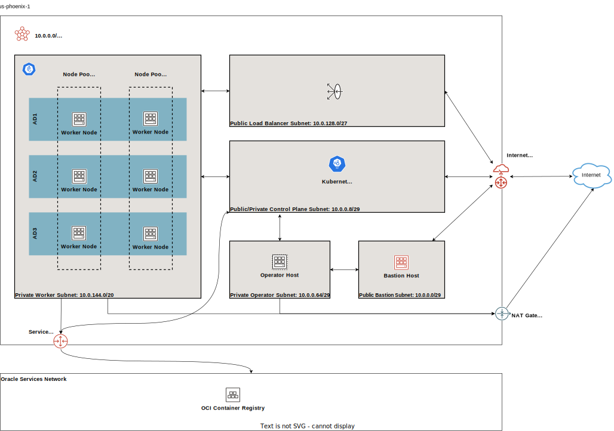

# Terraform OKE for Oracle Cloud Infrastructure

[changelog]: https://github.com/oracle-terraform-modules/terraform-oci-oke/releases
[contributing]: https://github.com/oracle-terraform-modules/terraform-oci-oke/blob/main/CONTRIBUTING.md
[license]: https://github.com/oracle-terraform-modules/terraform-oci-oke/blob/main/LICENSE
[canonical_license]: https://oss.oracle.com/licenses/upl/

[oci]: https://cloud.oracle.com/cloud-infrastructure
[oci_documentation]: https://docs.oracle.com/iaas/Content/services.htm
[oke]: https://docs.oracle.com/iaas/Content/ContEng/Concepts/contengoverview.htm

[docs]: https://github.com/oracle-terraform-modules/terraform-oci-oke/tree/main/docs
[prerequisites]: https://github.com/oracle-terraform-modules/terraform-oci-oke/blob/main/docs/prerequisites.md
[quickstart]: https://github.com/oracle-terraform-modules/terraform-oci-oke/blob/main/docs/quickstart.md
[diagrams]: https://github.com/oracle-terraform-modules/terraform-oci-oke/blob/main/docs/diagrams.md
[terraform_options]: https://github.com/oracle-terraform-modules/terraform-oci-oke/blob/main/docs/terraformoptions.md
[examples]: https://github.com/oracle-terraform-modules/terraform-oci-oke/tree/main/examples
[repo]: https://github.com/oracle-terraform-modules/terraform-oci-oke
[releases]: https://github.com/oracle-terraform-modules/terraform-oci-oke/releases
[terraform]: https://www.terraform.io
[terraform_oci]: https://registry.terraform.io/providers/oracle/oci/latest
[terraform_oci_examples]: https://github.com/oracle/terraform-provider-oci/tree/master/examples
[terraform_guides_examples]: https://github.com/hashicorp/terraform-guides/tree/master/infrastructure-as-code/terraform-0.12-examples

[terraform_oci_bastion]: https://github.com/oracle-terraform-modules/terraform-oci-bastion
[terraform_oci_operator]: https://github.com/oracle-terraform-modules/terraform-oci-operator
[terraform_oci_vcn]: https://github.com/oracle-terraform-modules/terraform-oci-vcn

The [Terraform OKE Module][repo] for [Oracle Cloud Infrastructure][oci] (OCI) provides a [Terraform][terraform] module that provisions an [OCI Kubernetes Engine (OKE)][oke] cluster with supporting infrastructure.

It creates the following resources:

* A Virtual Cloud Network (VCN) with public and private subnets, network security groups, and gateways (internet, NAT, service, DRG)
* An OKE cluster (basic or enhanced) with configurable CNI, Kubernetes version, and OIDC authentication
* Worker node pools in various modes: OKE-managed node pools, virtual node pools, self-managed instances, instance pools, cluster networks, and compute clusters
* A bastion host for SSH access into the VCN
* An operator host for cluster management with kubectl, Helm, and optional tools (k9s, istioctl, stern, k8sgpt)
* IAM dynamic groups, policies, and optional tag namespaces
* Kubernetes extensions deployed via Helm or YAML manifests

The module outputs the OKE cluster ID, endpoints, bastion and operator SSH commands, and network resource IDs. Detailed outputs such as kubeconfig are available when `output_detail = true`.

## Topology

The default deployment creates a VCN with the following subnets:

| Subnet | Purpose | Access |
|--------|---------|--------|
| bastion | Bastion host | Public |
| operator | Operator host | Private |
| cp | Kubernetes control plane | Private (or public) |
| workers | Worker nodes | Private |
| pods | Pod network (NPN CNI) | Private |
| int_lb | Internal load balancers | Private |
| pub_lb | Public load balancers | Public |

## Worker Modes

The module supports multiple worker management modes:

| Mode | Description | Use Case |
|------|-------------|----------|
| `node-pool` | OKE-managed node pools | General purpose workloads |
| `virtual-node-pool` | OKE-managed virtual nodes | Serverless, burstable workloads |
| `instance` | Self-managed compute instances | Custom node configuration |
| `instance-pool` | Self-managed instance pools | Scalable self-managed nodes |
| `cluster-network` | Self-managed cluster networks | HPC/GPU with RDMA networking |
| `compute-cluster` | Shared compute clusters | Multi-nodepool HPC clusters |

## Extensions

The module can deploy the following Kubernetes extensions:

| Extension | Method | Purpose |
|-----------|--------|---------|
| Cilium | Helm | eBPF-based networking, security, and observability |
| Multus | Daemonset | Multi-network pod interfaces |
| SR-IOV Device Plugin | Daemonset | SR-IOV network device advertisement |
| SR-IOV CNI Plugin | Daemonset | SR-IOV network connections |
| RDMA CNI Plugin | Daemonset | RDMA network connections |
| Whereabouts | Daemonset | IP address management for Multus |
| Metrics Server | Helm | Kubernetes metrics API |
| Cluster Autoscaler | Helm | Automatic node pool scaling |
| Prometheus | Helm | Monitoring and alerting |
| DCGM Exporter | Helm | GPU metrics for NVIDIA GPUs |
| Gatekeeper | Helm | OPA policy enforcement |
| MPI Operator | Manifest | MPI/NCCL distributed training jobs |
| ArgoCD | Helm | GitOps continuous delivery |

## [Documentation][docs]

- [Prerequisites][prerequisites]
- [Quickstart][quickstart]
- [Diagrams][diagrams]
- [Terraform Options][terraform_options]
- [Examples][examples]

## Related Documentation

- [Oracle Cloud Infrastructure Documentation][oci_documentation]
- [Terraform OCI Provider Documentation][terraform_oci]
- [OCI Kubernetes Engine Documentation][oke]
- [Terraform OCI Bastion Module][terraform_oci_bastion]

## Acknowledgement

Code derived and adapted from [Terraform OCI Examples][terraform_oci_examples] and HashiCorp's [Terraform 0.12 examples][terraform_guides_examples].

## Contributing

Learn how to [contribute][contributing].

## License

Copyright (c) 2017, 2025 Oracle Corporation and/or its affiliates. Licensed under the [Universal Permissive License 1.0][license] as shown at [https://oss.oracle.com/licenses/upl][canonical_license].
