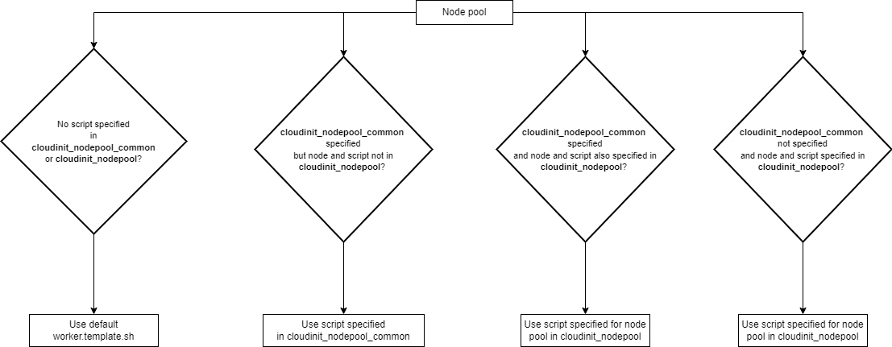

= cloud-init
:idprefix:
:idseparator: -
:sectlinks:
:toc: auto

:uri-cloudinit: https://docs.oracle.com/en-us/iaas/Content/ContEng/Tasks/contengusingcustomcloudinitscripts.htm
:uri-source-cloudinit-doc: https://github.com/oracle-terraform-modules/terraform-oci-oke/blob/main/docs/instructions.adoc#configuring-cloud-init-for-the-nodepools
:uri-repo: https://github.com/oracle-terraform-modules/terraform-oci-oke
:uri-worker-script: link:{uri-repo}/modules/oke/cloudinit/worker.template.sh


== Configuring cloud-init scripts for node pools:
There are 2 types of cloud-init scripts that can be configured for node pools:

. Common: these are cloud-init scripts that are common to all node pools
. Node pool specific: these are cloud-init scripts that are specific to particular node pools.

=== Default cloud-init

By default, the {uri-worker-script}[worker template] is used. The default worker template runs `oci-growfs` and `timedatectl` to configure the boot volume size and timezone respectively. 

=== Script precedence

If no value is configured for `cloudinit_nodepool_common` or for `cloudinit_nodepool`, this default template is used.

If a value is configured for `cloudinit_nodepool_common`, then this value is used instead. 

If a value is configured for `cloudinit_nodepool`, then this value is used for the specific nodepool only instead. Other nodepools will utilize whatever script is common.

The flowchart below depicts the script selection workflow:

.cloud-init script selection



== Overriding default cloud-init

=== Overriding the common cloud-init

The common cloud-init script for all node pools can be overriden as follows:

```
cloudinit_nodepool_common = "/tmp/cloudinit_nodepool_common.sh"
```

=== Specifying a cloud-init script for specific node pools

Sometimes, it may be desirable to configure additional settings for specific node pools without affecting the behaviour of existing or other node pools. In this case, you can override cloud-init as follows:

----
cloudinit_nodepool        = {
  np1 = "/tmp/np1_cloud-init.sh"
  np3 = "/tmp/np3_cloud-init.sh"
}
----

In the above example, node pool `np1` and `np3` will use `/tmp/np1_cloud-init.sh` and `/tmp/np3_cloud-init.sh` respectively for their cloud-init. 

NOTE: You must ensure that the node pool name specified for cloud-init matches those you defined in the `node_pools` variable. 
