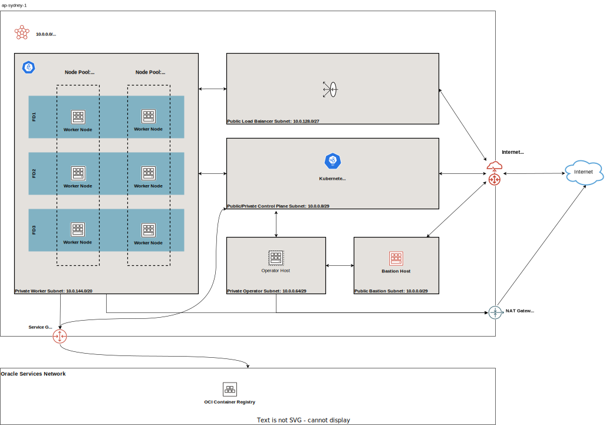
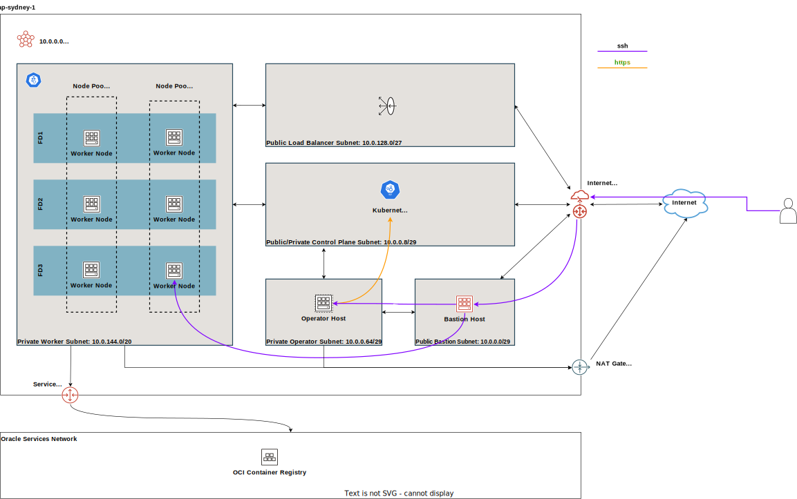
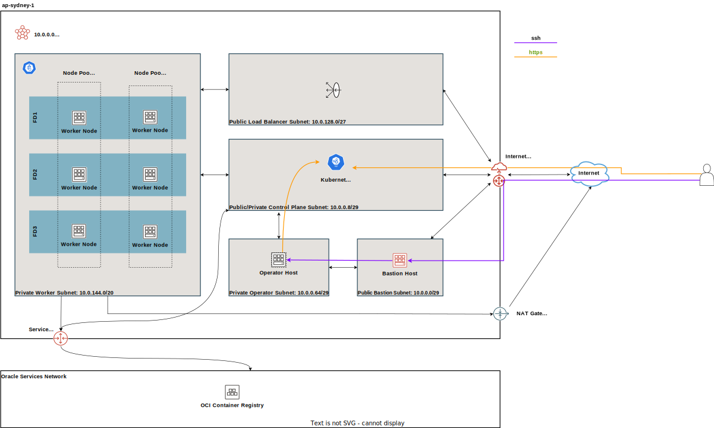
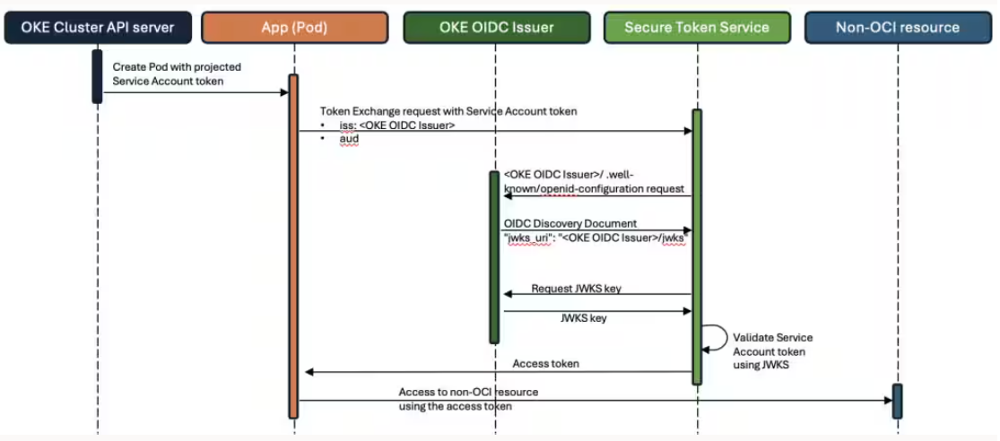

# Diagrams

This page collects the currently relevant architecture diagrams for the module.

## Default topologies

### Default Multi-AD topology

Shows the default regional deployment spread across multiple availability domains. The control plane, worker nodes, bastion, operator, and load balancer subnets are separated so the module can provide both public entry points and private east-west traffic paths.

### Default Single-AD topology

Shows the same baseline layout constrained to a single availability domain. This is the simpler topology when multi-AD placement is not required or not available in the target region.

## Network and access

### Network layout

Illustrates how the module divides the VCN into functional subnets and NSG boundaries. Use it to understand where the control plane, workers, pods, and load balancers live and how traffic is expected to flow between them.

### Load balancer layout

Highlights the public and internal load balancer subnet choices. This is the diagram to consult when deciding how to set `load_balancers`, `preferred_load_balancer`, and the related service exposure model.

### Bastion access layout

Shows the administrative access path into the VCN through the bastion host. It is useful when validating SSH reachability to private resources such as the operator or worker nodes.

## Exposure variants

### Public control plane topology

Shows the variant where the Kubernetes API endpoint is reachable through a public address. This is the most direct management model, but it also requires tighter control of the allowed CIDR ranges.

### Private control plane topology

Shows the variant where the Kubernetes API endpoint stays private inside the VCN. This is the preferred layout when cluster administration should happen from the bastion, operator, or connected private networks only.

### Public workers topology

Shows worker nodes with public IPs and direct outbound reachability. This can simplify bootstrap and troubleshooting, but it expands the exposed surface compared with private workers.

### Private workers topology

Shows worker nodes kept on private addresses behind the VCN gateways. This is the more typical production posture when outbound access is routed through NAT or service gateways instead of direct public addressing.

## Identity

### OIDC discovery flow

Explains the OIDC discovery integration exposed by the cluster. Use it when enabling `oidc_discovery_enabled` or documenting how external identity providers and token validation interact with the OKE API server.
