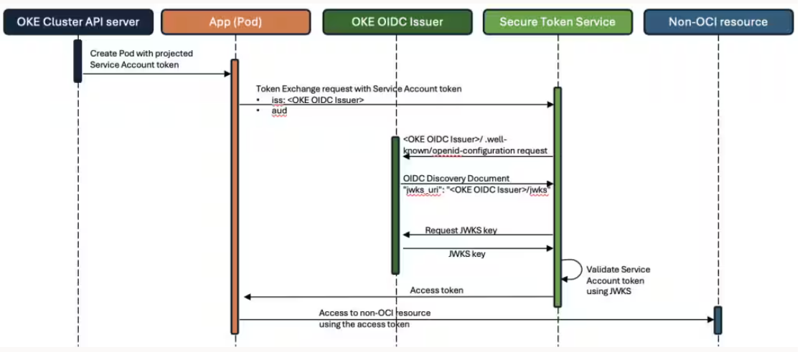

# OpenID Connect Discovery

With OKE OIDC Discovery, it is possible to validate Kubernetes pods running on OKE clusters with third-party STS (Security Token Service) issuers, whether on-premises or in cloud service providers (CSPs) such as Amazon Web Services (AWS) and Google Cloud Platform (GCP), and authorize them to access non-OCI resources. OKE OIDC Discovery enables this integration.

## Prerequisites

Note the following points when using OIDC Discovery:

- The cluster must be an enhanced cluster. OIDC Discovery is not supported for basic clusters.
- The cluster must be running Kubernetes version 1.21 (or later).

## Configuration

When you enable OIDC discovery for an OKE cluster, OKE provides an OpenID Connect issuer endpoint. This endpoint serves the OIDC discovery document and the JSON web key set (JWKS), which contain the public key necessary for token validation. These resources enable third-party IdP to validate tokens issued for pods in the OKE cluster, allowing those pods to access non-OCI resources.

[  ](../images/oidc-discovery.png)
*Figure 1: OIDC Discovery*

To enable the OKE OIDC Discovery, you have to set the following variable:

```
open_id_connect_discovery_enabled = true
```

The OpenID Connect issuer endpoint is available in the output:

```
cluster_oidc_discovery_endpoint
```

## Example usage

OIDC Discovery setup using Kubernetes API server flags

```javascript
{{#include ../../../examples/cluster-addons/vars-cluster-oidc-discovery.auto.tfvars:4:}}
```

## Reference
* [OKE OpenID Discovery](https://docs.oracle.com/en-us/iaas/Content/ContEng/Tasks/contengOpenIDConnect-Discovery.htm)
* [OKE Cluster Terraform resource](https://registry.terraform.io/providers/oracle/oci/latest/docs/resources/containerengine_cluster)
* [OKE Pods access AWS resources](https://umashankar-s.medium.com/multicloud-use-case-oke-apps-pods-accessing-aws-resources-using-openid-disovery-8e147500656f)
