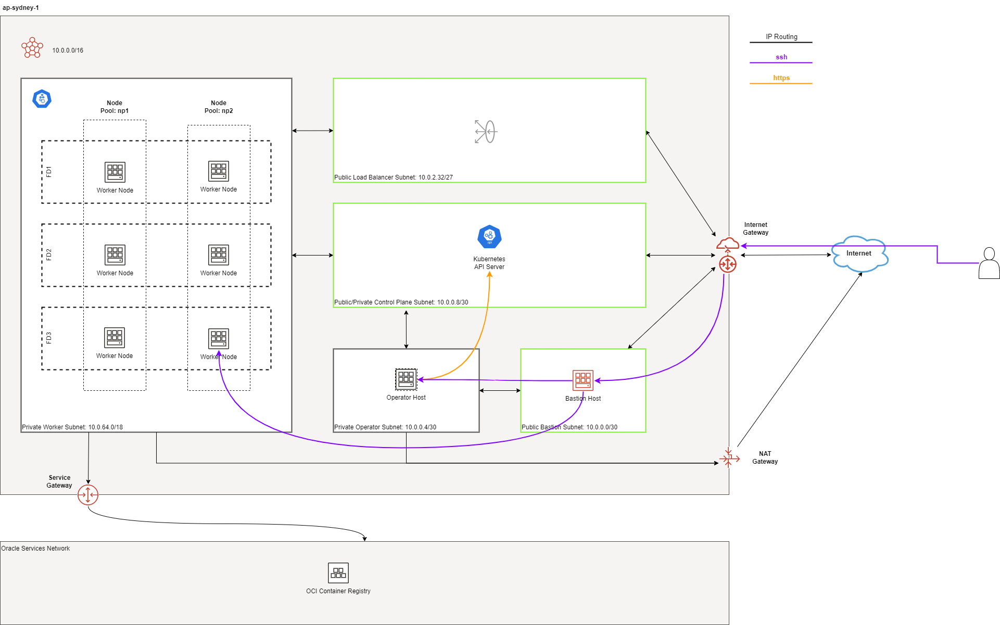
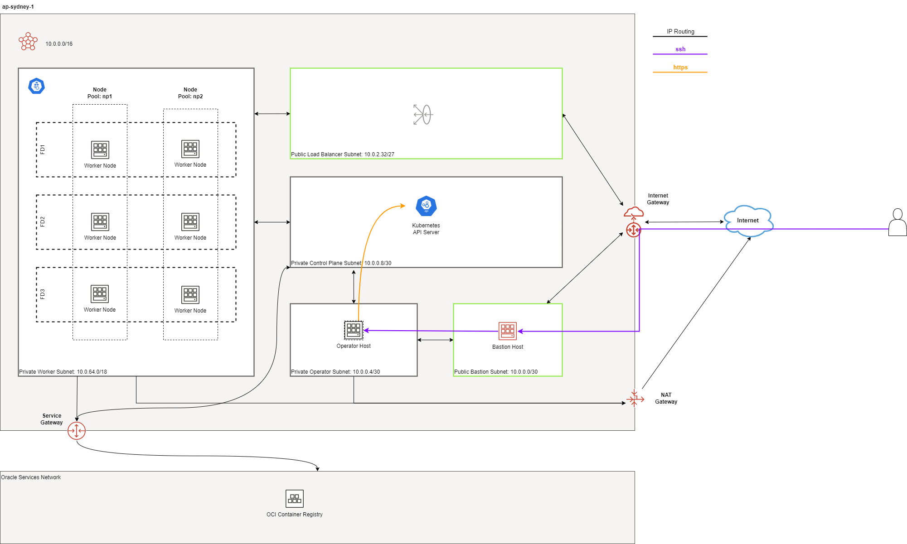
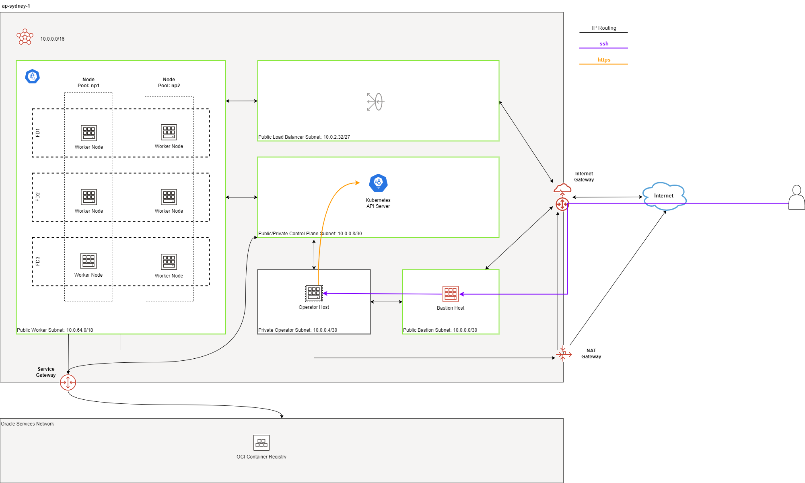
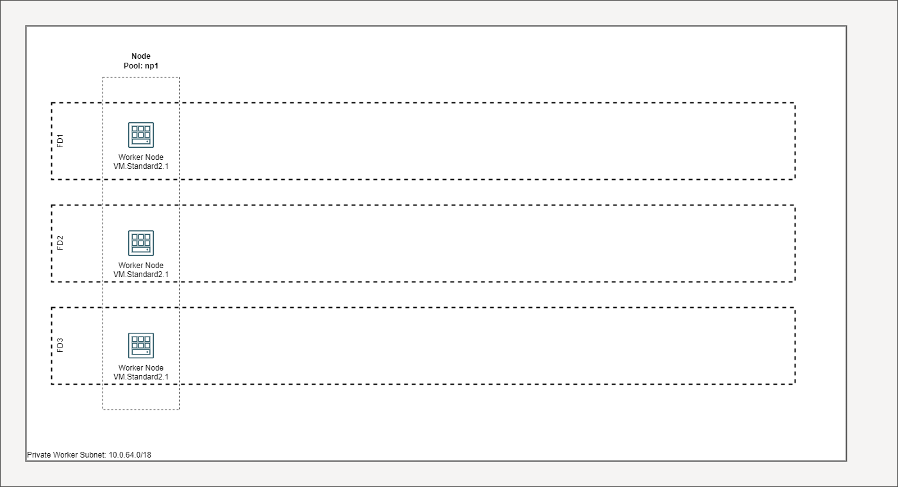
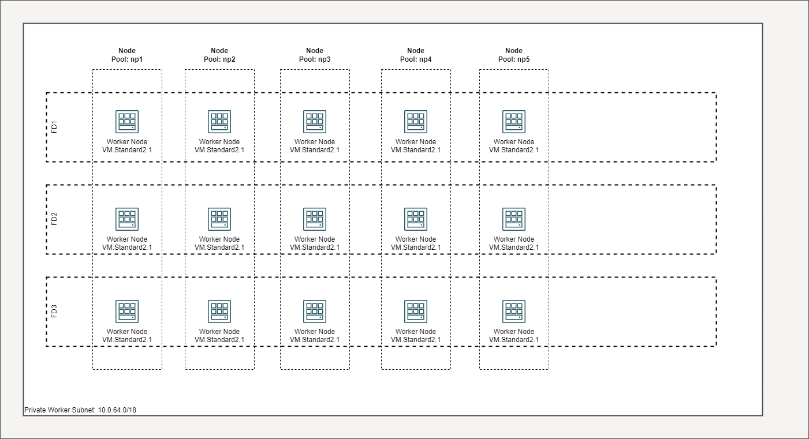
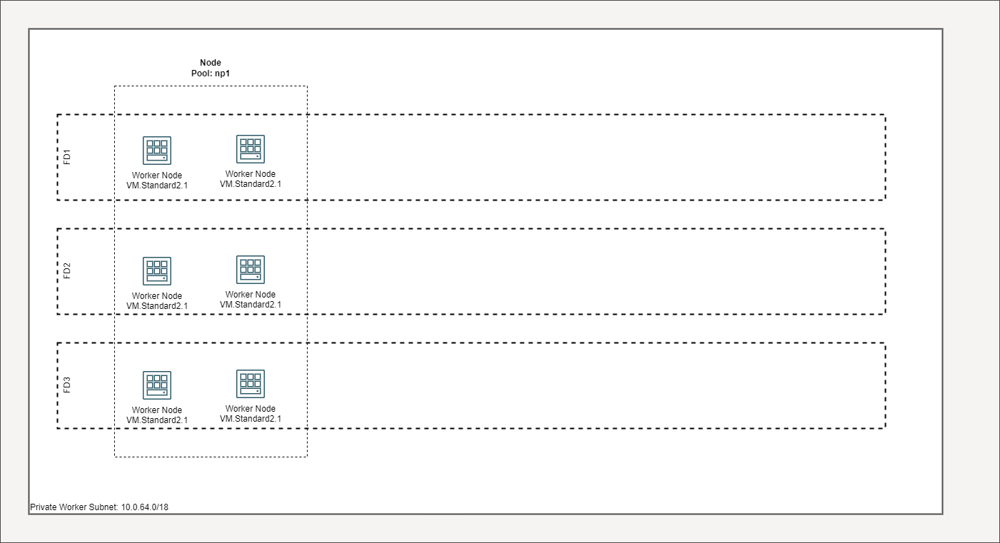
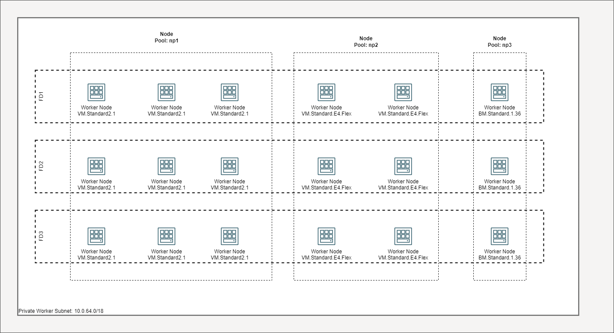
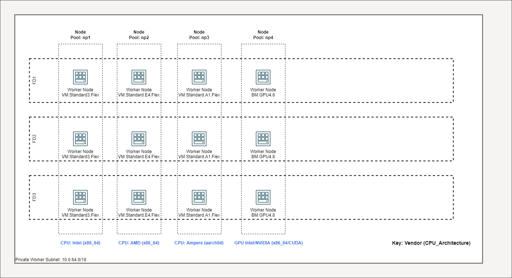
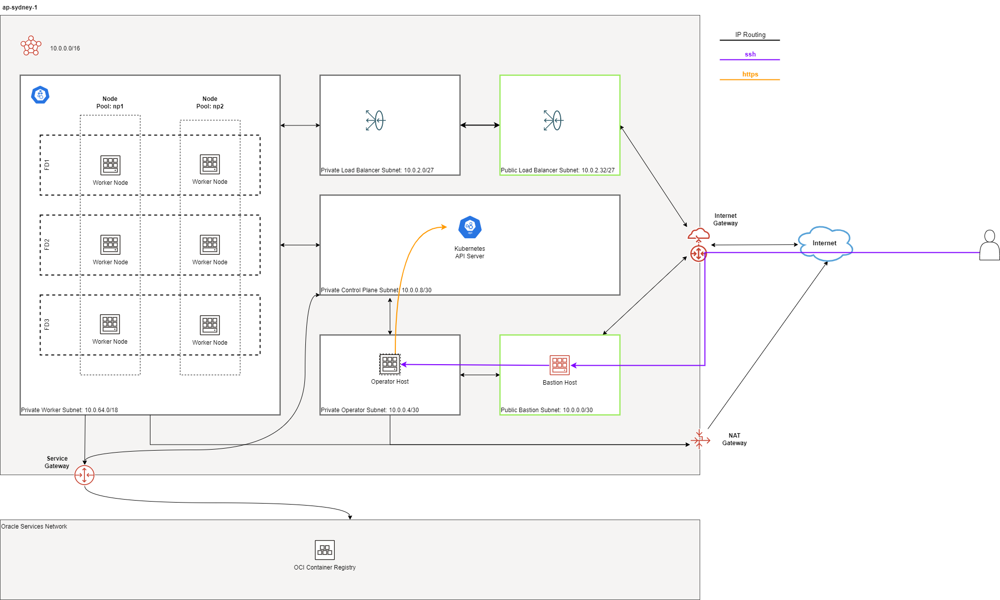

# Topology

The following resources are created by default:

* 1 VCN with Internet, NAT and Service Gateways
* Route tables for Internet, NAT and Service Gateways
* 1 regional public subnet for the bastion host along with its security list
* 1 regional private subnet for the operator host along with its NSG
* 1 public control plane subnet
* 1 private regional worker subnet
* 1 public regional load balancer
* 1 bastion host
* 1 operator host
* 1 public Kubernetes Cluster with private worker nodes
* 1 Network Security Group (NSG) for each of control plane, workers and load balancers

```admonish notice
The Kubernetes Control Plane Nodes run in Oracle's tenancy and are not shown here.

Although the recommended approach is to now deploy private clusters,***we are currently keeping the default setting to public***. This is to give our users the time to adjust other configurations e.g. their CI/CD tools.
```

The Load Balancers are only created when Kubernetes services of type *LoadBalancer* are deployed or you manually create Load Balancers yourself.

The diagrams below depicts the default deployment in multi-AD regions:

[  ](../images/defaultmad-large.svg)
*Figure 1: Multi-AD Default Deployment*

and single-AD regions:

[  ](../images/defaultsad-large.svg)
*Figure 2: Single-AD Default Deployment*

```admonish notice
The node pools above are depicted for illustration purposes only. By default, the clusters are now created without any node pools.
```

## Networking and Gateways

[  ](../images/networking-large.svg)
*Figure 3: Networking and Gateways*

The following subnets are created *by default*:

* 1 public regional control plane subnet: this subnet hosts an endpoint for the Kubernetes API server publicly accessible from the Internet. Typically, only 1 IP address is sufficient if you intend to host only 1 OKE cluster in this VCN. However, if you intend to host many OKE or Kubernetes clusters in this VCN and you intend to reuse the same subnets, you need to increase the default size of this subnet.
* 1 private regional worker subnet: this subnet hosts the worker nodes where your workloads will be running. By default, they are private. If you need admin access to the worker nodes e.g. SSH, you'll need to enable and use either the bastion host or the OCI Bastion Service.
* 1 public regional load balancer subnet: this subnet hosts your OCI Load Balancer which acts as a network ingress point into your OKE cluster.
* 1 public regional bastion subnet: this subnet hosts an optional bastion host. See additional documentation on the purpose of the bastion host. 
* 1 private regional operator subnet: this subnet hosts an optional operator host that is used for admin purposes. See additional documentation on the purpose of the operator host

```admonish warning
Do not confuse the bastion host with the OCI Bastion Service.
```

The bastion subnet is regional i.e. in multi-AD regions, the subnet spans all Availability Domains. By default, the bastion subnet is assigned a CIDR of `10.0.0.0/29` giving a maximum possible of 5 assignable IP addresses in the bastion subnet.

The workers subnet has a CIDR of `10.0.16.0/20` assigned by default. This gives the subnet a maximum possible of 4094 IP addresses. This is enough to scale the cluster to the maximum number of worker nodes (2000) currently allowed by Oracle Container Engine.

The load balancer subnets are of 2 types:
* public
* private

By default, only the the public load balancer subnet is created. See [Public and Internal Load Balancers](#public-vs-internal-load-balancers) for more details. The private load balancer subnet has a CIDR of `10.0.2.0/27` whereas the public load balancer subnet has a CIDR of `10.0.2.32/27` assigned by default. This allows both subnets to assign a maximum of 29 IP addresses and therefore 9 load balancers can be created in each. You can control the size of your subnets and have more load balancers if required by adjusting the newbit and netnum values for the `subnets` parameter.

The `subnets` parameter govern the boundaries and sizes of the subnets. If you need to change the default values, refer to the [Networking Documentation](./network_subnets.html#create-new-subnets-forced) to see how. We recommend working with your network administrator to design your network. The following additional documentation is useful in designing your network:
* [Erik Berg on Networks, Subnets and CIDR](https://erikberg.com/notes/networks.html)
* [Terraform cidrsubnet documentation](https://www.terraform.io/docs/configuration/functions/cidrsubnet.html)

The following gateways are also created:

* Internet Gateway: this is required if the application is public-facing or a public bastion host is used
* NAT Gateway if deployed in [private mode](#public-vs-private-worker-nodes)
* Service Gateway: this is required for connectivity between worker nodes and the control plane

The Service Gateway also allows OCI cloud resources without public IP addresses to privately access Oracle services and without the traffic going over the public Internet. Refer to the [OCI Service Gateway documentation](https://docs.cloud.oracle.com/iaas/Content/Network/Tasks/servicegateway.htm) to understand whether you need to enable it.

## Bastion Host



The bastion host is created in a public regional subnet. You can create or destroy it anytime with no effect on the Kubernetes cluster by setting the `create_bastion_host = true` in your variable file. You can also turn it on or off by changing the `bastion_state` to `RUNNING` or `STOPPED` respectively.

By default, the bastion host can be accessed from anywhere. However, you can restrict its access to a defined list of CIDR blocks using the `bastion_access` parameter.

You can use the bastion host for the following:

* SSH to the worker nodes
* SSH to the operator host to manage your Kubernetes cluster

To SSH to the bastion, copy the command that terraform outputs at the end of its run:
```properties
ssh_to_bastion = ssh -i /path/to/private_key opc@bastion_ip
```

To SSH to the worker nodes, you can do the following:
```shell
ssh -i /path/to/private_key -J <username>@bastion_ip opc@worker_node_private_ip
```

```admonish tip
**Note:** If your private ssh key has a different name or path than the default `~/.ssh/id_*` e.g `~/.ssh/dev_rsa`, you will need to add the private key to your ssh agent.
```

```shell
eval $(ssh-agent -s)
ssh-add ~/.ssh/dev_rsa
```
****

## Public vs Private Clusters

When deployed in public mode, the Kubernetes API endpoint is publicly accessible.

.Accessing the Kubernetes API endpoint publicly
image::images/publiccluster.png[align="center"]

You can set the Kubernetes cluster to be public and restrict its access to the CIDR blocks A.B.C.D/A and X.Y.Z.X/Z by using the following parameters:
```properties
control_plane_is_public     = true # *true/false
control_plane_allowed_cidrs = ["A.B.C.D/A","X.Y.Z.X/Z"]
```

When deployed in private mode, the Kubernetes endpoint can only be accessed from the operator host or from a defined list of CIDR blocks specified in `control_plane_allowed_cidrs`.

Accessing the Kubernetes API endpoint from the operator host:


The following table maps all possible cluster and workers deployment combinations.

****
**IMPORTANT:** Private clusters and workers are recommended.
****

## Public vs Private worker nodes

### Public




When deployed in public mode, all worker subnets will be deployed as public subnets and route to the Internet Gateway directly. Worker nodes will have both private and public IP addresses. Their private IP addresses will be from the range of the worker subnet they are part of whereas the public IP addresses will be allocated from Oracle's pool of public IP addresses.

NodePort and SSH access need to be explicitly enabled in order for the security rules to be properly configured and allow NodePort access.

```
allow_node_port_access  = true
allow_worker_ssh_access = true
```

### Private


When deployed in private mode, the worker subnet will be deployed as a private subnet and route to the NAT Gateway instead. 

Additionally, ssh access to the worker nodes *_must_* be done through the bastion host regardless of whether the worker nodes are deployed in public or private mode. If you intend to ssh to your worker nodes, ensure you have also link:terraformoptions.adoc#bastion-host[enabled the creation of the bastion host].

## Managing Workers Pools

**TODO** Update/refer to [./workers.md](./workers.md).

A node pool is a set of hosts within a cluster that all have the same configuration. A node pool requires the following configuration:

* name
* Kubernetes version
* the image to use to provision the worker nodes
* the shape of the worker nodes in the node pool
* the subnets the node pool will span
* the size of the cluster
* the public ssh key if you wish to ssh to your worker nodes (Optional)
* the Kubernetes labels to apply to the nodes (Optional)

Node pools enable you to create pools of machines within a cluster that have different configurations. For example, you might create one pool of nodes in a cluster as virtual machines and another pool of nodes as bare metal machines.

When using this module to create the node pools, the following is done:

* a number of node pools are created. The number of node pools created is equal to the number of elements in the node_pools parameter e.g.

```
worker_pools = {
  np1 = { shape = "VM.Standard.E4.Flex", ocpus = 1, memory = 16, node_pool_size = 1, boot_volume_size = 150, autoscale = true, label = { app = "frontend", pool = "np1" } }
  np2 = { shape = "VM.Standard.E4.Flex", ocpus = 1, memory = 16, node_pool_size = 1, boot_volume_size = 150, autoscale = true, label = { app = "frontend", pool = "np1" } }
}
```

will create 2 node pools (np1 and np2) whereas

```
worker_pools = {
  np1 = {shape="VM.Standard.E3.Flex",ocpus=2,node_pool_size=2,boot_volume_size=150}
  np2 = {shape="VM.Standard.E2.2",node_pool_size=2,boot_volume_size=150}
  np3 = {shape="VM.Standard.E2.2",node_pool_size=1}
}
```

will create 3 node pools (np1, np2 and np3).

* the node pool names are generated by combining the label_prefix, the node_pool_name_prefix (default value is "np") and the node pool number. The node pool names will therefore have names like labelprefix-np-1, labelprefix-np-2 and so on.

* the Kubernetes version is set automatically to the same version as that of the cluster at the time of the node pool's creation.

* the image used is an Oracle Linux image with the version specified. You can also specify your own image OCID. However, note that these 2 parameters are *_mutually exclusive_* i.e. either use Operating System and version **or** specify the OCID of your custom image.

* the [shape](https://docs.cloud.oracle.com/iaas/Content/Compute/References/computeshapes.htm) of the worker node determines the compute capacity of the worker node. The shape of the node pool is specified in a map and consists of the following parameters:

** the compute shape
** the node pool size
** the boot volume size
** the Kubernetes label

```
node_pools = {
  np1 = { shape = "VM.Standard.E4.Flex", ocpus = 1, memory = 16, node_pool_size = 1, boot_volume_size = 150, label = { app = "frontend", pool = "np1" } }
  np2 = {shape="VM.Standard.E2.2",node_pool_size=2,boot_volume_size=150}
  np3 = {shape="VM.Standard.E2.2",node_pool_size=1}
}
```

In the above example, workers in node pool np1 will all have a shape of VM.Standard.E4.Flex with boot volume size 150GB whereas workers in node pool np2 will all have a shape of VM.Standard.E2.2 and workers in node pool np3 will all have a shape of VM.Standard.E2.2 but only a single worker node. 

****
**Note:** The public SSH key will be the same as that used for the bastion host by default.
****

=== Number of Node Pools

The number, shape and size of the node pools created is controlled by the number of entries in the node_pools parameter. Each key and tuple pair corresponds to 1 node pool. 

****
**Note:** A minimum of 1 worker node per node pool will be created.
****

The diagram below shows a cluster with 1 node pool of size 3 i.e. setting the following configuration:
```
node_pools = {
  np1 = {shape="VM.Standard2.1",node_pool_size=3}
}
```

The above will yield a node pool with 3 worker nodes (other details removed for convenience):



You can increase the number of node pools by adding more entries in the node_pools e.g.:

```properties
node_pools = {
  np1 = {shape="VM.Standard2.1",node_pool_size=3}
  np2 = {shape="VM.Standard2.1",node_pool_size=3}
  np3 = {shape="VM.Standard2.1",node_pool_size=3}
  np4 = {shape="VM.Standard2.1",node_pool_size=3}
  np5 = {shape="VM.Standard2.1",node_pool_size=3}
}
```

Node pools each of size 3 worker nodes


You can also change the node pool size e.g.
```
node_pools = {
  np1 = {shape="VM.Standard2.1",node_pool_size=6}
}
```

The above will yield a node pool with 6 worker nodes:



Similarly, you can support mixed workloads by adding node pools of different shapes and sizes:

```
node_pools = {
  np1 = {shape="VM.Standard2.1",node_pool_size=9}
  np2 = {shape="VM.Standard.E3.Flex",ocpus=2,node_pool_size=6}
  np3 = {shape="BM.Standard1.36",node_pool_size=3}
}
```

Mixed workload with different node pool shapes and sizes:



Mixed architectures(x86_64,aarch64,x86_64/CUDA) with different node pool shapes and sizes:



### Fault Domains

A fault domain is a grouping of hardware and infrastructure within an Availability Domain. Each availability domain contains three fault domains. Fault domains let you distribute your instances so that they are not on the same physical hardware within a single availability domain. A hardware failure or Compute hardware maintenance that affects one fault domain does not affect instances in other fault domains.

When a node pool is created, the worker nodes are spread over all three fault domains.


## Public vs. Internal Load Balancers

By default, public load balancers are created when you deploy services of type `LoadBalancer`. Public load balancers have public IP addresses. You can also use internal load balancers. Internal load balancers have only private IP addresses and are not accessible from the Internet. 

The following parameters govern the creation of load balancers:
* `load_balancers`
* `preferred_load_balancer`

The table below shows the valid combinations of preferred_load_balancer and subnet_type values.

**TODO**

### Using Public Load Balancers

When creating a public load balancer, you *_must_* specify the list of NSGs using annotations e.g.:

```yaml
apiVersion: v1
kind: Service
metadata:
  name: acme-website
  annotations:
    oci.oraclecloud.com/oci-network-security-groups: "ocid1.networksecuritygroup...."
    service.beta.kubernetes.io/oci-load-balancer-security-list-management-mode: "None"
spec:
  type: LoadBalancer
  ....
```

Note that since we have already added the NodePort range to the public load balancer NSG, you can also disable the security list management and set its value to `"None"`.

### Using Internal Load Balancers

When creating an internal load balancer, you must ensure the following:
* `load_balancers` is set to `both` or `internal`.

You can also set the `preferred_load_balancer` to `internal` so if you happen to use both, the cluster will preference the internal load balancer subnets instead.




Note that even if you set the `preferred_load_balancer` to `internal`, you still need to set the correct {uri-oci-loadbalancer-annotations}[annotations] when creating internal load balancers. Just setting the subnet to be private is *_not_* sufficient e.g.:
```yaml
service.beta.kubernetes.io/oci-load-balancer-internal: "true"
```

Refer to [OCI Documentation](https://docs.cloud.oracle.com/iaas/Content/ContEng/Tasks/contengcreatingloadbalancer.htm#CreatingInternalLoadBalancersinPublicandPrivateSubnets) for further guidance on internal load balancers.

### Creating LoadBalancers using IngressControllers

Refer to _Experimenting with Ingress Controllers on Oracle Container Engine (OKE)_ [Part 1](https://medium.com/oracledevs/experimenting-with-ingress-controllers-on-oracle-container-engine-oke-part-1-5af51e6cdb85) & [Part 2](https://medium.com/oracledevs/experimenting-with-ingress-controllers-on-oracle-container-engine-oke-part-2-96063927d2e6) for additional information.
