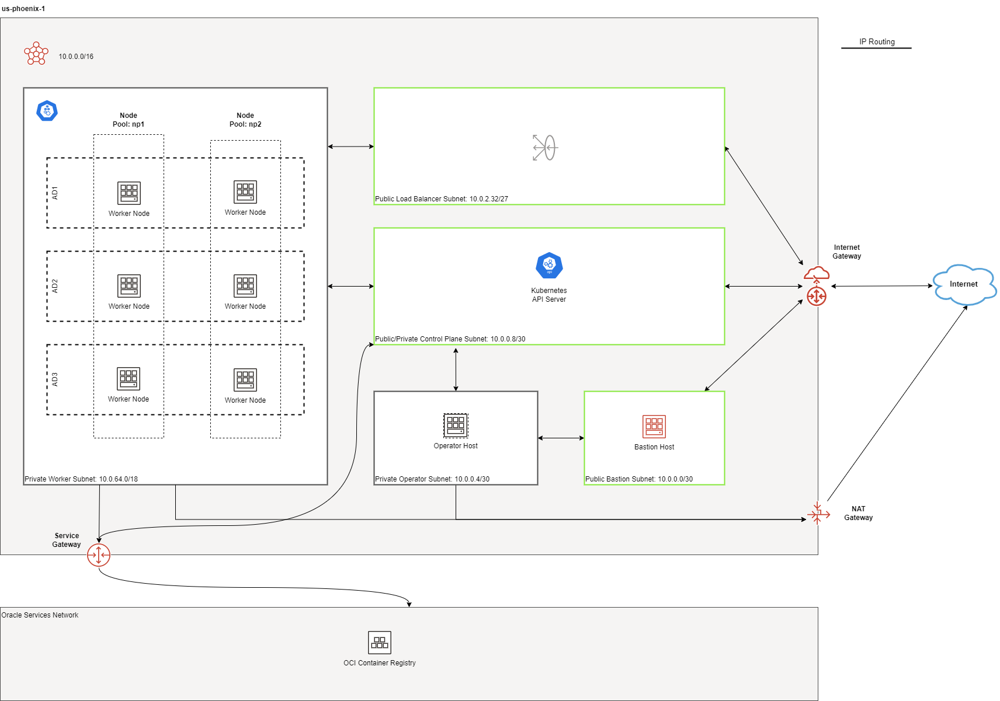
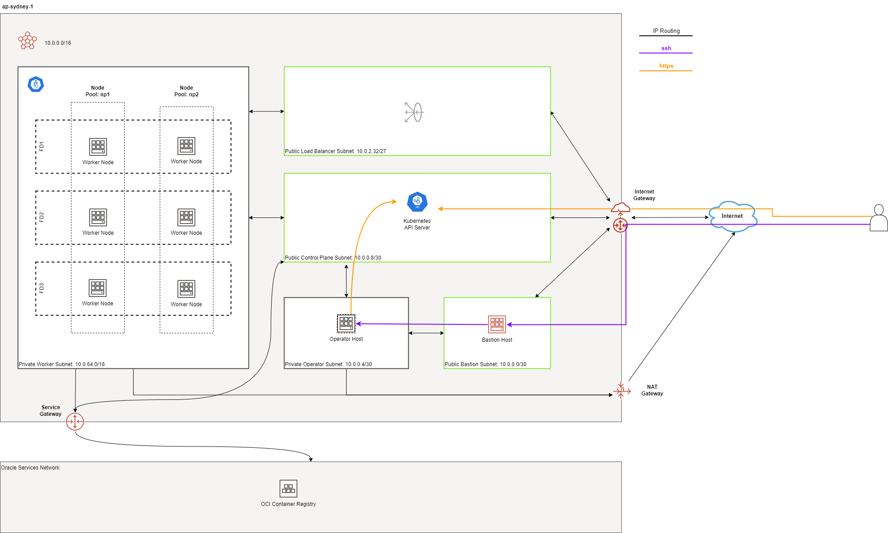
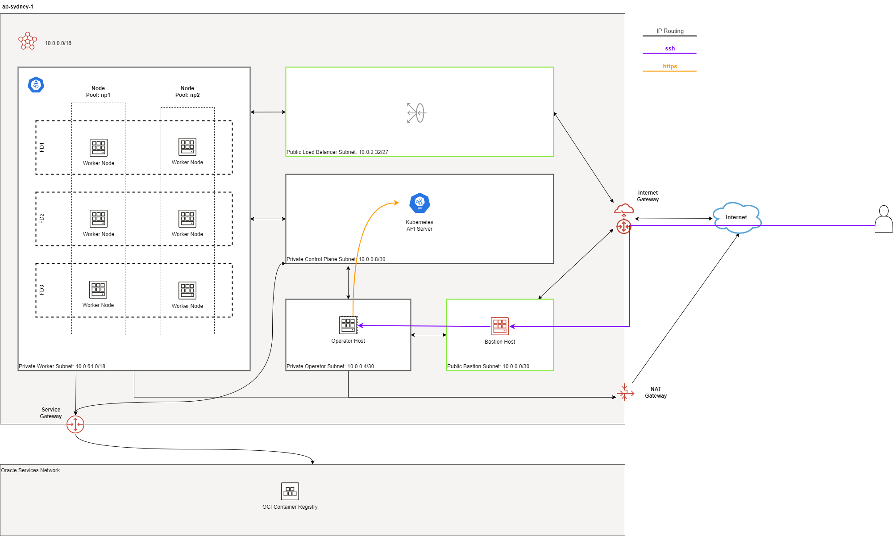
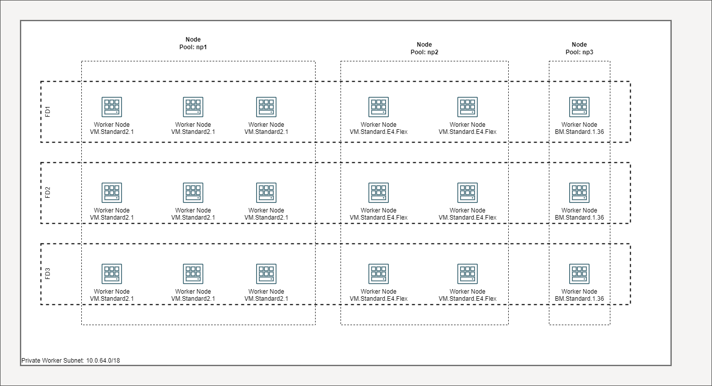

= Topology
:idprefix:
:idseparator: -
:sectnums:
:sectlinks:
:bl: pass:[ +]
:toc: auto

:uri-repo: https://github.com/oracle-terraform-modules/terraform-oci-oke

:uri-rel-file-base: link:{uri-repo}/blob/main
:uri-rel-tree-base: link:{uri-repo}/tree/main
:uri-docs: {uri-rel-file-base}/docs
:uri-networks-subnets-cidr: https://erikberg.com/notes/networks.html
:uri-oci-configure-cli: https://docs.cloud.oracle.com/iaas/Content/API/SDKDocs/cliinstall.htm#SettinguptheConfigFile
:uri-oci-images: https://docs.cloud.oracle.com/iaas/images/
:uri-oci-loadbalancer-annotations: https://github.com/oracle/oci-cloud-controller-manager/blob/master/docs/load-balancer-annotations.md
:uri-oci-oke-internal-lb: https://docs.cloud.oracle.com/iaas/Content/ContEng/Tasks/contengcreatingloadbalancer.htm#CreatingInternalLoadBalancersinPublicandPrivateSubnets
:uri-oci-oke-ingresscontrollers-1: https://medium.com/oracledevs/experimenting-with-ingress-controllers-on-oracle-container-engine-oke-part-1-5af51e6cdb85
:uri-oci-oke-ingresscontrollers-2: https://medium.com/oracledevs/experimenting-with-ingress-controllers-on-oracle-container-engine-oke-part-2-96063927d2e6
:uri-oci-region: https://docs.cloud.oracle.com/iaas/Content/General/Concepts/regions.htm
:uri-oci-service-gateway: https://docs.cloud.oracle.com/iaas/Content/Network/Tasks/servicegateway.htm
:uri-oci-shape: https://docs.cloud.oracle.com/iaas/Content/Compute/References/computeshapes.htm
:uri-terraform-cidrsubnet: https://www.terraform.io/docs/configuration/functions/cidrsubnet.html
:uri-terraform-cidrsubnet-deconstructed: http://blog.itsjustcode.net/blog/2017/11/18/terraform-cidrsubnet-deconstructed/

:uri-topology: {uri-docs}/topology.adoc

=== Default Deployment

By default, the following resources are created:

* 1 VCN with Internet, NAT and Service Gateways
* Route tables for Internet, NAT and Service Gateways
* 1 regional public subnet for the bastion host along with its security list
* 1 regional private subnet for the operator host along with its NSG
* 1 public control plane subnet
* 1 private regional worker subnet
* 1 public regional load balancer
* 1 bastion host
* 1 operator host
* 1 public Kubernetes Cluster with private worker nodes
* 1 Network Security Group (NSG) for each of control plane, workers and load balancers

[Important]
====
. The Kubernetes Control Plane Nodes run in Oracle's tenancy and are not shown here.
. Although the recommended approach is to now deploy private clusters, *we are currently keeping the default setting to public*. This is to give our users the time to adjust other configurations e.g. their CI/CD tools etc.
====

The Load Balancers are only created when Kubernetes services of type *LoadBalancer* are deployed or you manually create Load Balancers yourself.

.Multi-AD Default Deployment


{bl}

.Single-AD Default Deployment
image::images/defaultsad.png[align="center"]

=== Networking and Gateways

.Networking and Gateways
image::images/networking.png[align="Networking and Gateways"]

{bl}

The following resources are created:

* 1 public regional control plane subnet
* 1 private regional worker subnet
* 1 public regional load balancer subnet
* 1 public regional bastion subnet
* 1 private regional operator subnet

The bastion subnet is regional i.e. in multi-AD regions, the subnet spans all Availability Domains. By default, the bastion subnet is assigned a CIDR of 10.0.0.0/29 giving a maximum possible of 5 assignable IP addresses in the bastion subnet.

The workers subnet has a CIDR of 10.0.64.0/18 assigned by default. This gives the subnet a maximum possible of 16381 IP addresses. This is enough to scale the cluster to the maximum number of worker nodes (1000) currently allowed by Oracle Container Engine.

The load balancer subnets are of 2 types:

* public
* private

By default, only the the public load balancer subnet is created. See link:#public-and-internal-load-balancers[Public and Internal Load Balancers] for more details. The private load balancer subnet has a CIDR of 10.0.2.0/27 whereas the public load balancer subnet has a CIDR of 10.0.2.32/27 assigned by default. This allows both subnets to assign a maximum of 29 IP addresses and therefore 9 load balancers can be created in each. You can control the size of your subnets and have more load balancers if required by adjusting the newbit and netnum values for the `subnets` parameter.

The `subnets` parameter govern the boundaries of the subnets. If you need to change the default values, refer to this project's link:terraformoptions.adoc#oci-networking[Networking Documentation] to see how. We recommend working with your network administrator to design your network. The following additional documentation is useful in designing your network:

* {uri-networks-subnets-cidr}[Erik Berg on Networks, Subnets and CIDR]
* {uri-terraform-cidrsubnet-deconstructed}[Lisa Hagemann on Terraform cidrsubnet]
* {uri-terraform-cidrsubnet}[Terraform cidrsubnet documentation]

Additionally, the following gateways are created:

* Internet Gateway (required if application is public facing or bastion host is used)
* NAT Gateway if deployed in link:#public-vs-private-worker-nodes[private mode]
* Service Gateway

The Service Gateway enables OCI cloud resources without public IP addresses to privately access Oracle services and without the traffic going over the public Internet. Refer to the {uri-oci-service-gateway}[OCI Service Gateway documentation] to understand whether you need to enable it.

=== Bastion Host

.SSH to Bastion
image::images/bastion.png[align="center"]

{bl}

The bastion host is created in a public regional subnet. You can create or destroy it anytime with no effect on the Kubernetes cluster by setting the `create_bastion_host = true` in your variable file. You can also turn it on or off by changing the `bastion_state` to `RUNNING` or `STOPPED` respectively.

By default, the bastion host can be accessed from anywhere. However, you can restrict its access to a defined list of CIDR blocks using the `bastion_access` parameter.

You can use the bastion host for the following:

. ssh to the worker nodes
. ssh to the operator host to manage your Kubernetes cluster

To ssh to the bastion, copy the command that terraform outputs at the end of its run:

```
ssh_to_bastion = ssh -i /path/to/private_key opc@bastion_ip
```

To ssh to the worker nodes, you can do the following:

```
ssh -i /path/to/private_key -J <username>@bastion_ip opc@worker_node_private_ip
```

****
N.B. If your private ssh key has a different name or path than the default "~/.ssh/id_*" e.g "~/.ssh/dev_rsa", you will need to add the private key to your ssh agent:

----
eval $(ssh-agent -s)
ssh-add ~/.ssh/dev_rsa
----
****

=== Public vs Private Clusters

When deployed in public mode, the Kubernetes API endpoint is publicly accessible.

.Accessing the Kubernetes API endpoint publicly


You can set the Kubernetes cluster to be public and restrict its access to the CIDR blocks A.B.C.D/A and X.Y.Z.X/Z by using the following parameters:

```
control_plane_type = "public"

control_plane_allowed_cidrs = ["A.B.C.D/A","X.Y.Z.X/Z"]
```

When deployed in private mode, the Kubernetes endpoint can only be accessed from the operator host or from a defined list of CIDR blocks specified in `control_plane_allowed_cidrs`.

.Accessing the Kubernetes API endpoint from the operator host


The following table maps all possible cluster and workers deployment combinations.

.Public and Private cluster and workers combinations

[stripes=odd,cols="<.2d,^.2d,^.2d", width="100%"] 
|===
|
|control_plane_type=public
|control_plane_type=private

|worker_type=public
|X
|X

|worker_type=private
|X
|X

|===

[IMPORTANT]
For new clusters, we recommend you provision private clusters and private workers.

=== Public vs Private worker nodes

.Public Worker Nodes
image::images/publicworkers.png[align="center"]

{bl}

When deployed in public mode, all worker subnets will be deployed as public subnets and route to the Internet Gateway directly. Worker nodes will have both private and public IP addresses. Their private IP addresses will be from the range of the worker subnet they are part of whereas the public IP addresses will be allocated from Oracle's pool of public IP addresses.

NodePort and SSH access need to be explicitly enabled in order for the security rules to be properly configured and allow NodePort access.

[source]
----
allow_node_port_access = true

allow_worker_ssh_access = true
----

When deployed in private mode, the worker subnet will be deployed as a private subnet and route to the NAT Gateway instead. 

Additionally, ssh access to the worker nodes *_must_* be done through the bastion host regardless of whether the worker nodes are deployed in public or private mode. If you intend to ssh to your worker nodes, ensure you have also link:terraformoptions.adoc#bastion-host[enabled the creation of the bastion host].

=== Managing Node Pools

A node pool is a set of hosts within a cluster that all have the same configuration. A node pool requires the following configuration:

* name
* Kubernetes version
* the image to use to provision the worker nodes
* the shape of the worker nodes in the node pool
* the subnets the node pool will span
* the size of the cluster
* the public ssh key if you wish to ssh to your worker nodes (Optional)
* the Kubernetes labels to apply to the nodes (Optional)

Node pools enable you to create pools of machines within a cluster that have different configurations. For example, you might create one pool of nodes in a cluster as virtual machines and another pool of nodes as bare metal machines.

When using this module to create the node pools, the following is done:

* a number of node pools are created. The number of node pools created is equal to the number of elements in the node_pools parameter e.g.

----
node_pools = {
  np1 = { shape = "VM.Standard.E4.Flex", ocpus = 1, memory = 16, node_pool_size = 1, boot_volume_size = 150, autoscale = true, label = { app = "frontend", pool = "np1" } }
  np2 = { shape = "VM.Standard.E4.Flex", ocpus = 1, memory = 16, node_pool_size = 1, boot_volume_size = 150, autoscale = true, label = { app = "frontend", pool = "np1" } }
}
----

will create 2 node pools (np1 and np2) whereas

----
node_pools = {
  np1 = {shape="VM.Standard.E3.Flex",ocpus=2,node_pool_size=2,boot_volume_size=150}
  np2 = {shape="VM.Standard.E2.2",node_pool_size=2,boot_volume_size=150}
  np3 = {shape="VM.Standard.E2.2",node_pool_size=1}
}
----

will create 3 node pools (np1, np2 and np3).

* the node pool names are generated by combining the label_prefix, the node_pool_name_prefix (default value is "np") and the node pool number. The node pool names will therefore have names like labelprefix-np-1, labelprefix-np-2 and so on.

* the Kubernetes version is set automatically to the same version as that of the cluster at the time of the node pool's creation.

* the image used is an Oracle Linux image with the version specified. You can also specify your own image OCID. However, note that these 2 parameters are *_mutually exclusive_* i.e. either use Operating System and version *_or_* specify the OCID of your custom image.

* the {uri-oci-shape}[shape] of the worker node determines the compute capacity of the worker node. The shape of the node pool is specified in a map and consists of the following parameters:

** the compute shape
** the node pool size
** the boot volume size
** the Kubernetes label

----
node_pools = {
  np1 = { shape = "VM.Standard.E4.Flex", ocpus = 1, memory = 16, node_pool_size = 1, boot_volume_size = 150, label = { app = "frontend", pool = "np1" } }
  np2 = {shape="VM.Standard.E2.2",node_pool_size=2,boot_volume_size=150}
  np3 = {shape="VM.Standard.E2.2",node_pool_size=1}
}
----

In the above example, workers in node pool np1 will all have a shape of VM.Standard.E4.Flex with boot volume size 150GB whereas workers in node pool np2 will all have a shape of VM.Standard.E2.2 and workers in node pool np3 will all have a shape of VM.Standard.E2.2 but only a single worker node. 

[IMPORTANT]
====
Note that:

* the public ssh key used is the same as that used for the bastion host.
====

==== Number of Node Pools

The number, shape and size of the node pools created is controlled by the number of entries in the node_pools parameter. Each key and tuple pair corresponds to 1 node pool. 

****
N.B A minimum 1 worker node per node pool will be created.
****

The diagram below shows a cluster with 1 node pool of size 3 i.e. setting the following configuration:

----
node_pools = {
  np1 = {shape="VM.Standard2.1",node_pool_size=3}
}
----

will result in the following:

.1 Node Pool of size 3 worker nodes (other details removed for convenience)
image::images/np311.png[align="center"]

{bl}

You can increase the number of node pools by adding more entries in the node_pools e.g. 

----
node_pools = {
  np1 = {shape="VM.Standard2.1",node_pool_size=3}
  np2 = {shape="VM.Standard2.1",node_pool_size=3}
  np3 = {shape="VM.Standard2.1",node_pool_size=3}
  np4 = {shape="VM.Standard2.1",node_pool_size=3}
  np5 = {shape="VM.Standard2.1",node_pool_size=3}
}
----

.5 Node Pools each of size 3 worker nodes
image::images/np351.png[align="center"]

You can also change the node pool size e.g.

----
node_pools = {
  np1 = {shape="VM.Standard2.1",node_pool_size=6}
}
----

will result in the following cluster:

.1 Node Pool with 6 worker nodes
image::images/np312.png[align="center"]

{bl}

Similarly, you can support mixed workloads by adding node pools of different shapes and sizes:

----
node_pools = {
  np1 = {shape="VM.Standard2.1",node_pool_size=9}
  np2 = {shape="VM.Standard.E3.Flex",ocpus=2,node_pool_size=6}
  np3 = {shape="BM.Standard1.36",node_pool_size=3}
}
----

.4 Mixed workload with different node pool shapes and sizes


=== Fault Domains

A fault domain is a grouping of hardware and infrastructure within an Availability Domain. Each availability domain contains three fault domains. Fault domains let you distribute your instances so that they are not on the same physical hardware within a single availability domain. A hardware failure or Compute hardware maintenance that affects one fault domain does not affect instances in other fault domains.

When a node pool is created, the worker nodes are spread over all three fault domains.

image::images/defaultsad.png[align="center"]

=== Public and Internal Load Balancers

By default, public load balancers are created when you deploy services of type *LoadBalancer*. Public load balancers have public IP addresses.

You can also use internal load balancers. Internal load balancers have only private IP addresses and are not accessible from the Internet. 

==== Public and Internal Load Balancer combinations

The following parameters govern how load balancers are created with:

* load_balancers

* preferred_load_balancer

The table below shows the valid combinations of preferred_load_balancer and subnet_type values.

.Public and Internal Load Balancer combinations
[stripes=odd,cols="<.2d,^.2d,^.2d", width="100%"] 
|===
|
|preferred_load_balancer=internal
|preferred_load_balancer=public
|load_balancers=both
|X
|X

|load_balancers=internal
|X
|

|load_balancers=public
|
|X

|===

==== Using Public Load Balancers

When creating a public load balancer, you *_must_* specify the list of NSGs using annotations e.g.

----
apiVersion: v1
kind: Service
metadata:
  name: acme-website
  annotations:
    oci.oraclecloud.com/oci-network-security-groups: "ocid1.networksecuritygroup...."
    service.beta.kubernetes.io/oci-load-balancer-security-list-management-mode: "None"
spec:
  type: LoadBalancer
  ....
----

Note that since we have already added the NodePort range to the public load balancer NSG, you can also disable the security list management and set its value to `"None"`.

==== Using Internal Load Balancers

When creating an internal load balancer, you must ensure the following:

* `load_balancers` is set to `both` or `internal`. 

You can also set the `preferred_load_balancer` to `internal` so if you happen to use both, the cluster will preference the internal load balancer subnets instead.

.Using Private Load Balancers (worker nodes removed for convenience)
image::images/privatelbs.png[align="Private Load Balancers"]

{bl}

Note that even if you set the `preferred_load_balancer` to `internal`, you still need to set the correct {uri-oci-loadbalancer-annotations}[annotations] when creating internal load balancers. Just setting the subnet to be private is *_not_* sufficient e.g. :

[source]
----
service.beta.kubernetes.io/oci-load-balancer-internal: "true"
----

Refer to the {uri-oci-oke-internal-lb}[OCI Documentation] for how to create internal load balancers with OKE.

==== Creating LoadBalancers using IngressControllers

Review the following articles on creating public and private load balancers using Ingress Controllers:

* {uri-oci-oke-ingresscontrollers-1}[Experimenting with Ingress Controllers on Oracle Container Engine (OKE) — Part 1]
* {uri-oci-oke-ingresscontrollers-2}[Experimenting with Ingress Controllers on Oracle Container Engine (OKE) — Part 2]
