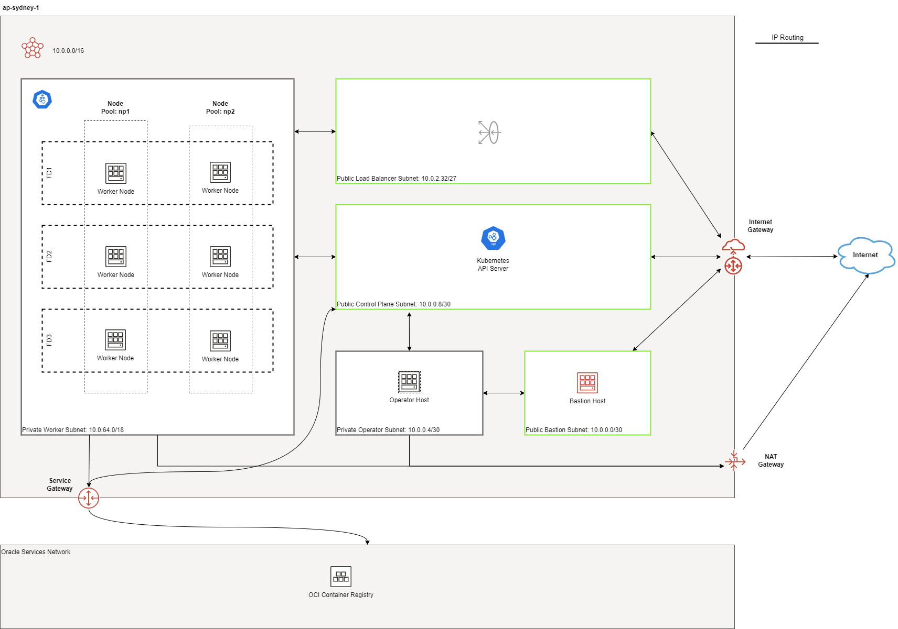
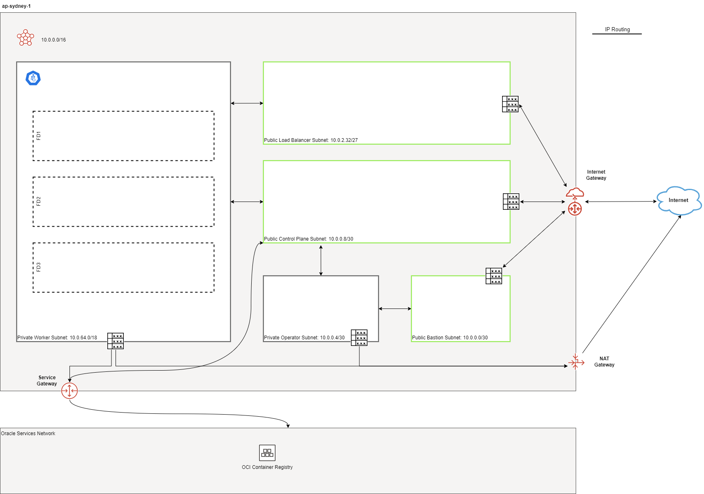
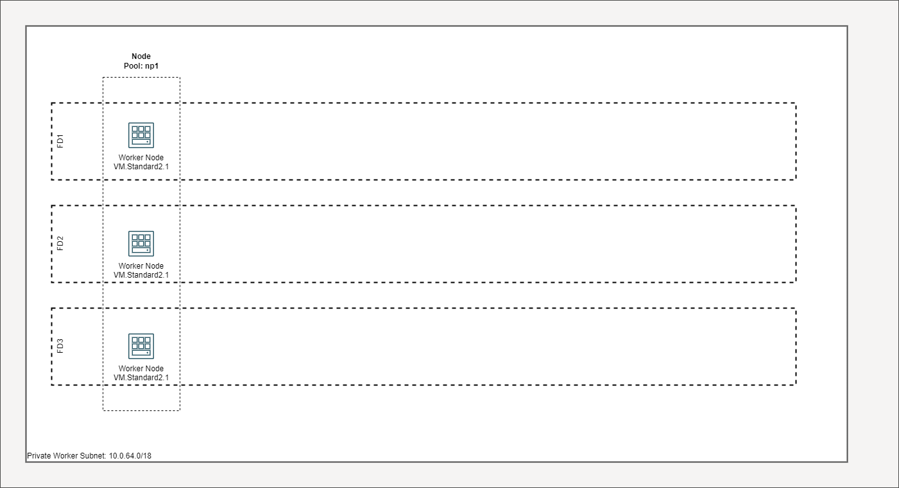
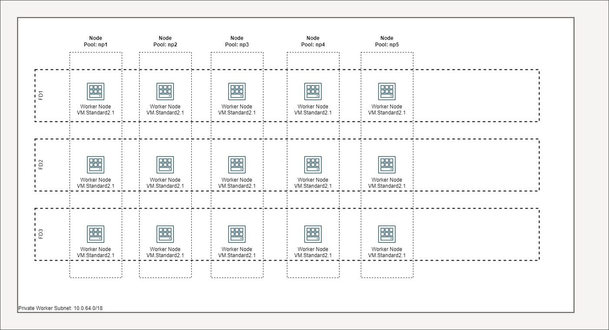

= Topology
:idprefix:
:idseparator: -
:sectlinks:
:uri-repo: https://github.com/oracle-terraform-modules/terraform-oci-oke

:uri-rel-file-base: link:{uri-repo}/blob/v12docs
:uri-rel-tree-base: link:{uri-repo}/tree/v12docs
:uri-docs: {uri-rel-file-base}/docs
:uri-networks-subnets-cidr: https://erikberg.com/notes/networks.html
:uri-oci-configure-cli: https://docs.cloud.oracle.com/iaas/Content/API/SDKDocs/cliinstall.htm#SettinguptheConfigFile
:uri-oci-images: https://docs.cloud.oracle.com/iaas/images/
:uri-oci-loadbalancer-annotations: https://github.com/oracle/oci-cloud-controller-manager/blob/master/docs/load-balancer-annotations.md
:uri-oci-region: https://docs.cloud.oracle.com/iaas/Content/General/Concepts/regions.htm
:uri-oci-service-gateway: https://docs.cloud.oracle.com/iaas/Content/Network/Tasks/servicegateway.htm
:uri-oci-shape: https://docs.cloud.oracle.com/iaas/Content/Compute/References/computeshapes.htm
:uri-terraform-cidrsubnet: https://www.terraform.io/docs/configuration/functions/cidrsubnet.html
:uri-terraform-cidrsubnet-deconstructed: http://blog.itsjustcode.net/blog/2017/11/18/terraform-cidrsubnet-deconstructed/

:uri-topology: {uri-docs}/topology.adoc

This section describes the various topologies you can deploy.

link:#default-deployment[Default Deployment]

link:#single-vs-multiple-ad-regions-deployment[Single vs. Multiple AD regions deployment]

link:#networking-and-gateways[Networking and Gateways]

link:#bastion-host[Bastion Host]

link:#public-vs-private-worker-nodes[Public vs Private worker nodes]

link:#node-pools[Node Pools]

link:#worker-nodes-per-subnet[Worker Nodes per subnet]

link:#fault-domains[Fault Domains]

link:#public-and-internal-load-balancers[Public and Internal Load Balancers]

=== Default Deployment

By default, the following resources are created:

* 1 VCN with Internet, NAT and Service Gateways
* Route tables for Internet, NAT and Service Gateways
* 1 regional public subnet for the Bastion Host along with its security list
* 3 private worker subnets along with security list
* 3 public load balancer subnets along with security list
* 1 Bastion Host
* 1 Kubernetes Cluster with worker nodes

[Note]
The Kubernetes Master Nodes run in Oracle's tenancy and are not shown here.

The Load Balancers are only created when services of type LoadBalancer are deployed.

.Multi-AD Default Deployment
image::images/defaultmad.png[align="center"]

.Single-AD Default Deployment

=== Single vs Multiple AD regions deployment

=== Networking and Gateways

.Networking and Gateways

The following resources are created:

* 3 worker subnets
* 3 load balancer subnets
* 1 regional bastion subnet

The bastion subnet is regional i.e. in multi-AD regions, the subnet spans all Availability Domains. By default, the bastion subnet is assigned a CIDR of 10.0.2.96/27 giving a maximum possible of 5 IP addresses. This will allow room for future capabilities.

The worker subnets have the following CIDRs assigned by default:

* 10.0.64.0/18
* 10.0.128.0/18
* 10.0.192.0/18

This gives each subnet a maximum possible of 16381 IP addresses and therefore number of hosts per subnet. This is enough to scale the cluster to the maximum number of worker nodes (5000) currently supported by Kubernetes.

The load balancer subnets consist of 2 types:

* public
* private

By default, only the the public load balancer subnets are created. See link:#public-and-internal-load-balancers[Public and Internal Load Balancers] for more details. The public load balancer subnets have the following CIDRs assigned by default:

* 10.0.2.96/27
* 10.0.2.128/27
* 10.0.2.160/27

This gives each subnet a maximum possible of 29 IP addresses and therefore number of load balancers per subnet.

The OCI Networking parameters are controlled by the following 3 parameters:

* vcn_cidr
* newbits
* subnets

Refer to this project's link:terraformoptions.adoc#oci-networking[Networking Documentation] to see how you can change these. We recommend working with your network administrator to design your network. The following additional documentation is useful in designing your network:

* {uri-networks-subnets-cidr}[Erik Berg on Networks, Subnets and CIDR]
* {uri-terraform-cidrsubnet-deconstructed}[Lisa Hagemann on Terraform cidrsubnet Deconstructed]
* {uri-terraform-cidrsubnet}[Terraform cidrsubnet documentation]

Additionally, the following gateways are created:

* Internet Gateway (required)
* NAT Gateway if deployed in link:#public-vs-private-worker-nodes[private mode]
* Service Gateway if using Oracle Services

The Service Gateway enables cloud resources without public IP addresses to privately access Oracle services. The Service Gateway allows access to Oracle Services without the traffic going over the public Internet. Refer to the {uri-oci-service-gateway}[OCI Service Gateway documentation] to understand whether you need to enable it.

=== Bastion Host

.SSH to Bastion (load balancer subnets removed for convenience)
image::images/bastion.png[align="center"]

The bastion host is created in a public regional subnet. You can create or destroy it anytime with no effect on the Kubernetes cluster by setting the *create_bastion* = true in your variable file.

By default, the bastion host can be accessed from anywhere. However, you can restrict its access to a particular CIDR block using the *bastion_access* parameter.

You can use the bastion host for the following:

. ssh to the worker nodes
. manage your Kubernetes cluster

To ssh to the bastion, a script (scripts/tesseract.sh) is generated which you can use to login to the bastion itself.

To ssh to the worker nodes, you can do the following:

----
ssh -i /path/to/private_key -J <username>@bastion_ip opc@worker_node_private_ip
----

When the bastion host is created, the following are pre-installed and configured:

* git, kubectl, helm, oci-cli
* default KUBECONFIG location (~/.kube/config)
* aliases kubectl (k), helm (h), oci-cli (oci)

Although oci-cli is pre-installed, it is *_not_* configured. Read more about {uri-oci-configure-cli}[configuring the oci-cli].

=== Public vs Private worker nodes

.Public Worker Nodes
image::images/public.png[align="center"]

When deployed in public mode, all worker subnets will be deployed as public subnets and route to the Internet Gateway directly. Worker nodes will have both private and public IP addresses. The private IP address will be that of the worker subnet they are part of whereas the public IP address will be allocated from Oracle's pool of public IP addresses.

NodePort and SSH access need to be explicitly enabled in order for the security rules to be properly configured and allow NodePort access.

[source]
----
allow_node_port_access = true

allow_worker_ssh_access = true
----

When deployed in private mode, all worker subnets will be deployed as private subnets and route to the NAT Gateway instead. 

Additionally, ssh access to the worker nodes *_must_* be done through the bastion host regardless of whether the worker nodes are deployed in public or private mode. If you intend to ssh to your worker nodes, ensure you have also link:terraformoptions.adoc#bastion-host[enabled the creation of the bastion host].

=== Node Pools

<explain what a node pool is>

A node pool requires the following information:

* name
* Kubernetes version
* the image to use to provision the worker nodes
* the shape of the worker nodes in the node pool
* the subnets the node pool will span
* the number of worker nodes per subnet
* the public ssh key if you wish to ssh to your worker nodes (Optional)
* the Kubernetes labels to apply to the nodes (Optional)

When using this project to create the node pools, the following is done:

* a number of node pools are created. This is controlled by the node_pools parameter. By default, this value is 1.

* the node pool names are generated by combining a prefix and the node pool number. The prefix is set by the node_pool_name_prefix parameter and has a default value of "np". The node pool names will therefore have names like np-1, np-2 and so on.

* the Kubernetes version is set automatically to the same version as the cluster.

* the image used is an Oracle Linux image with the version specified. You can also specify your own image OCID. However, note that these 2 are mutually exclusive i.e. either use Operating System and version *_or_* specify the OCID of your custom image.

* the {uri-oci-shape}[shape] of the worker node determines the compute capacity of the worker node. By default, this is VM.Standard2.1, giving you 1 OCPU, 15GB Memory, 1 Gbps in network bandwidth and 2 VNICs.

* the subnets the node pool will span i.e. the subnets where the worker nodes will be created. See below for more explanation.

* the number of worker nodes per subnet that will be created for this node pool. This is controlled by the node_pool_quantity_per_subnet parameter.

* the public ssh key used is the same as that used for the bastion host.

* Kubernetes labels are not currently configured. You can still add them to the node pools after they are created.

There are 3 node pool topologies available for deployment: 1,2 and 3.

Topology 1 applies only for single-AD regions whereas Topologies 2 and 3 apply to multi-AD regions. Additionally, note that Topology 2 is *still experimental*.

<Topology 1. Show diagram with FD>

When using Topology 3, this ensures that the node pool spans all 3 worker subnets. Since the worker subnets are created in different Availability Domains, this ensure that the Kubernetes cluster spans all 3 Availability Domains.

<Topology 2>

==== Node Pools

The diagram below shows a cluster with 1 node pool and 1 worker node per subnet using topology 3 i.e. node_pools=1, node_pool_quantity_per_subnet=1 and nodepool_topology=3.

.1 Node Pool with 1 worker node per subnet (other details removed for convenience)

You can increase the number of node pools by setting node_pools=5, node_pool_quantity_per_subnet=1 and nodepool_topology=3.

.5 Node Pool with 1 worker node per subnet

==== Worker Nodes per subnet

You can also change the number of worker nodes per subnet. For example, setting the node_pools=1 and node_pool_quantity_per_subnet=1 and nodepool_topology=3 will result in the following cluster:

.1 Node Pool with 2 worker node per subnet
image::images/np312.png[align="center"]

Similarly, you can change both node pools and number of worker nodes per subnet:

.4 Node Pool with 2 worker node per subnet
image::images/np342.png[align="center"]

=== Fault Domains

=== Public and Internal Load Balancers