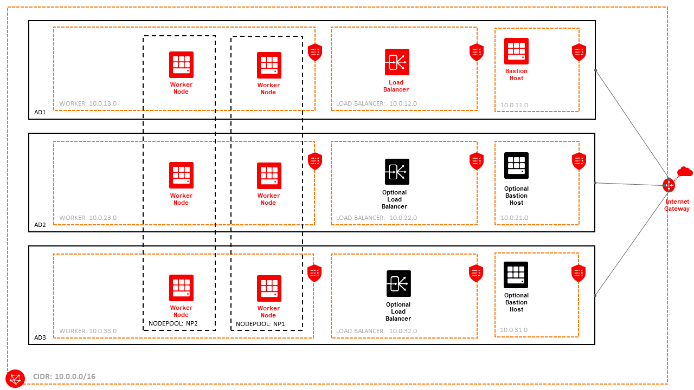
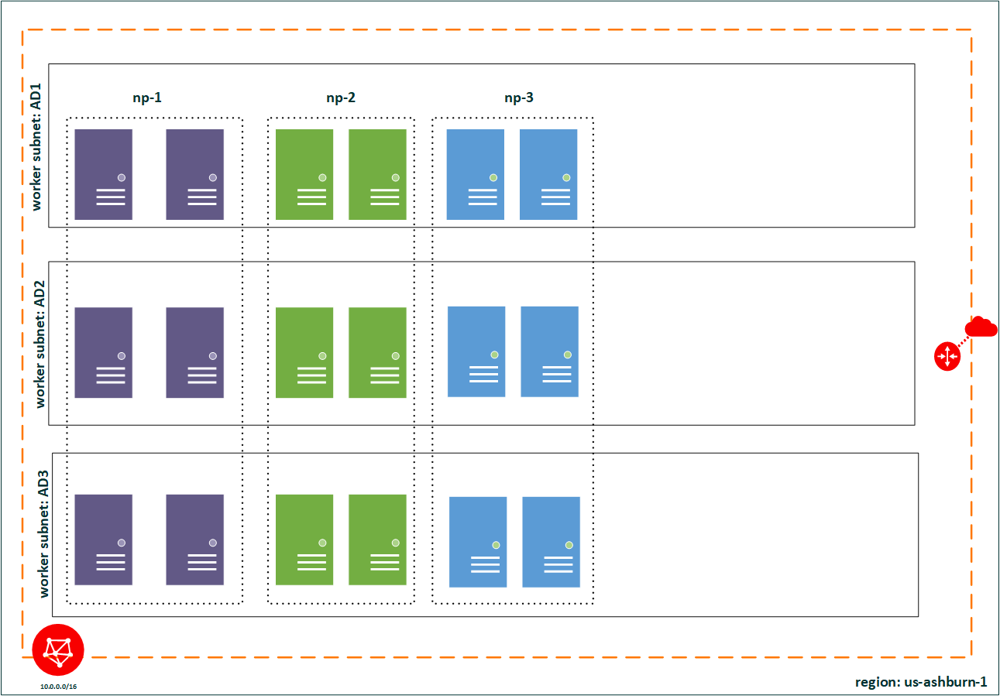
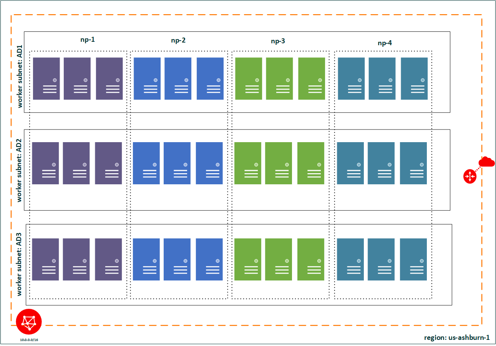
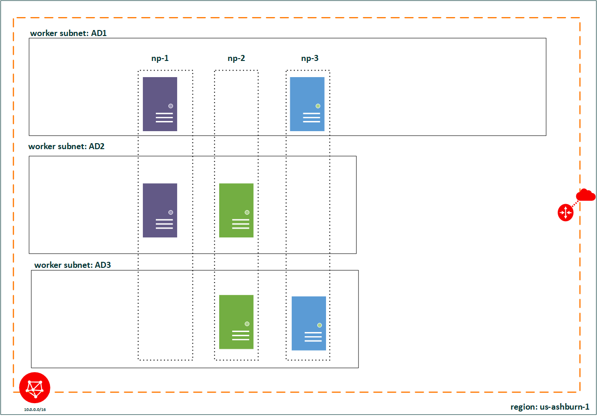
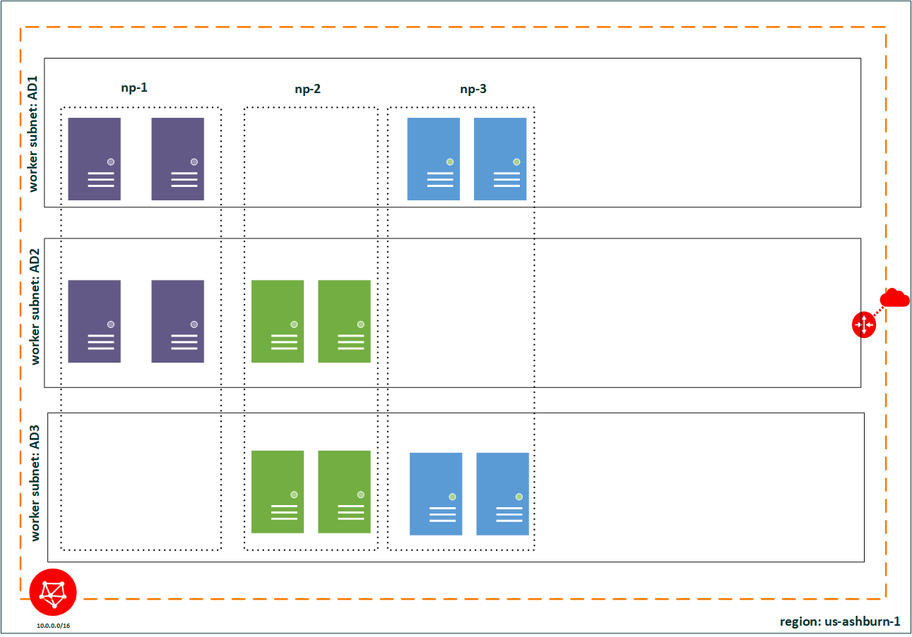
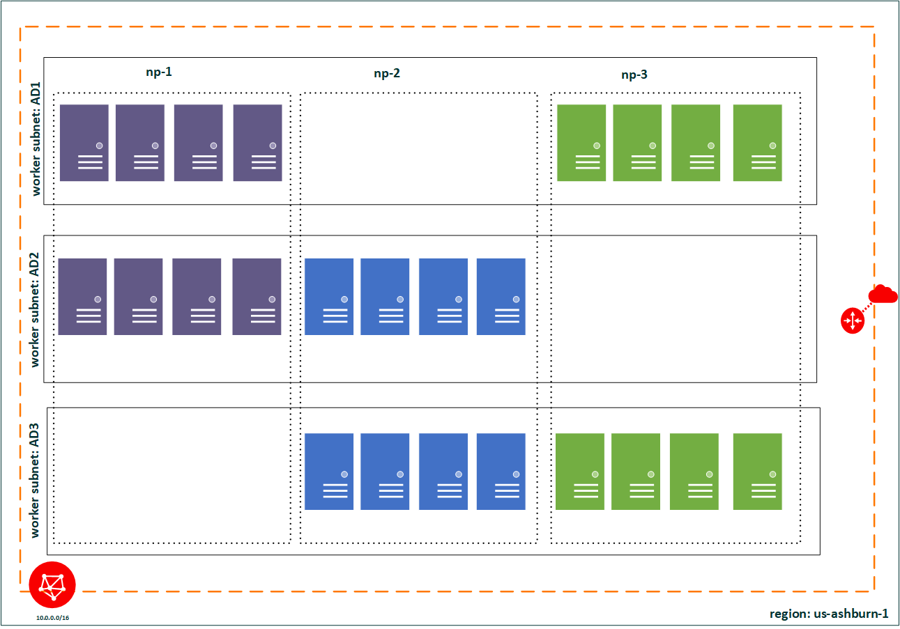

[example network resource configuration]:https://docs.us-phoenix-1.oraclecloud.com/Content/ContEng/Concepts/contengnetworkconfigexample.htm
[helm]:https://www.helm.sh/
[terraformkubernetesinstaller]: https://github.com/oracle/terraform-kubernetes-installer/blob/master/docs/input-variables.md#network-access-configuration

# Architecture and Topology

The following diagram depicts what will be created depending on your selection:

## Bastion Host

At the moment, OKE runs on public subnets and the K8s API Server is also publicly accessible after successful authentication and authorization. In the near future, OKE will support running on private subnets. As examples, refer to the [various deployment options][terraformkubernetesinstaller] for the Terraform Kubernetes Installer. The bastion host is to prepare the project for the eventuality that a bastion host is needed to interact with the API Server, upgrade the worker nodes or perform other administrative work.

In the meantime, the bastion host facilitates the following:

1. pre-installed and configured oci-cli according to selected compartment, region
2. pre-installed kubectl and kubectl bash completion
3. kubeconfig generated in default location (~/.kube/config) so once logged in, you do not need to explicitly export KUBECONFIG variable
4. faster execution of kubectl commands due to the host being closer to the API Server
5. pre-installed and upgraded to latest version of helm client
11. k8s secret script creation based on OCI authentication token. The k8s secret can then be used as imagePullSecrets for pulling image from OCIR

## Node Pool Topology

There are 3 parameters that control the topology of your cluster:

- node_pool_quantity_per_subnet
- node_pools
- nodepool_topology

When you [create a VCN for your OKE][example network resource configuration], you will have at least 3 subnets in the 3 ADs of your selected region for the worker nodes.

When you create a node pool, you need to further configure the following:

1. number of nodes per subnet
2. which subnets will the node pool be part of

The OKE project supports 2 topologies for the Node Pools:

- 2 subnets
- 3 subnets

Each subnet will reside within a separate AD (1-3).

### 3-subnet topology
Setting nodepool_topology=3, node_pools=3 and node_pool_quantity_per_subnet=1 will create the following worker node deployment:

Setting nodepool_topology=3, node_pools=3 and node_pool_quantity_per_subnet=2 will create the following worker node deployment:

Setting nodepool_topology=3, node_pools=4 and node_pool_quantity_per_subnet=3 will create the following worker node deployment:

### 2-subnet topology
If you choose the 2 subnet topology, then the node pools will attempt a fair distribution of the node pools across the subnets.

Setting nodepool_topology=2, node_pools=3 and node_pool_quantity_per_subnet=1 will create the following worker node deployment:

Setting nodepool_topology=2, node_pools=3 and node_pool_quantity_per_subnet=2 will create the following worker node deployment:

Setting nodepool_topology=2, node_pools=3 and node_pool_quantity_per_subnet=4 will create the following worker node deployment:

## Recommendations

1. Choose the 3-subnet topology - the 2-subnet topology is still being tested for the allocation algorithm's robustness
2. Calculate how many worker nodes will be created using the following formula: **nodepool_topology** x **node_pools** x **node_pool_quantity_per_subnet**
3. Ensure your tenancy has enough available compute for the shape you have chosen for the worker nodes. If not, you can request a raise in the service limits.
4. Choose a different shape for your bastion hosts from your worker instances.